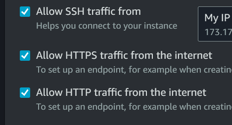

### **Objective**

Deployment of bookstack application within an AWS environment.

### **Steps**

1. Preparation of the user-data script

I wrote a user-data script that i use during the installation of the EC2 instance. This script will automatically install and configure the bookstack application by also downloading the files. But, we have to configure the database after. The script is named "user-data.sh".

2. Configuration and Launch of an EC2 instance

Now that the user-data is ready, we will launch the EC2 instance needed to host the application.

So, we select "Launch instances" button to configure our ec2 instance. I use the Amazon Linux AMI with the t2.micro instance type. It's enough for our need and it's included in the free tier of aws.

I create a security group to allow only HTTP (port 80), HTTPS(port 443) and SSH only on my IP:

4. 
