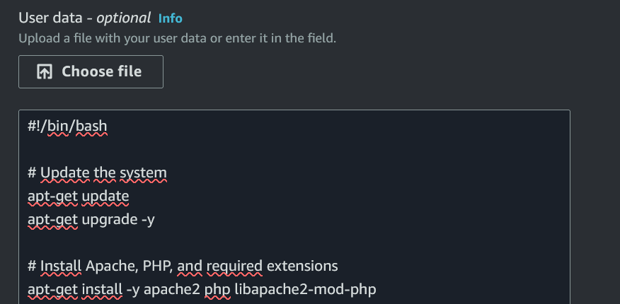
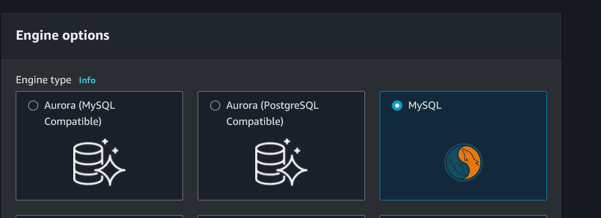
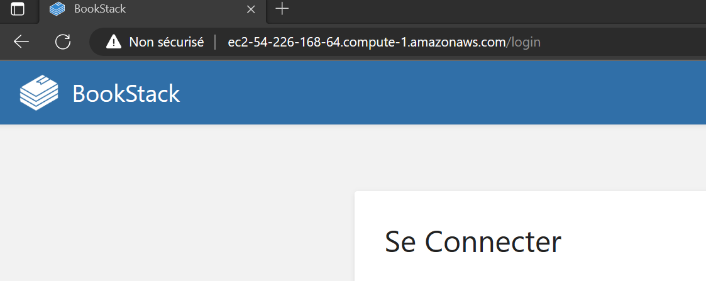

### **Objective**

Deployment of bookstack application within an AWS environment.

### **Steps**

1. Preparation of the user-data script

I wrote a user-data script that i use during the installation of the EC2 instance. This script will automatically install and configure the bookstack application by also downloading the files. But, we have to configure the database after. The script is named "user-data.sh".

2. Configuration and Launch of an EC2 instance

Now that the user-data is ready, we will launch the EC2 instance needed to host the application.

So, we select "Launch instances" button to configure our ec2 instance. I use the Amazon Linux AMI with the t2.micro instance type. It's enough for our need and it's included in the free tier of aws.

In the "Advanced Details" section, we will paste the script in "User data" text box:

I create a security group to allow only HTTP (port 80), HTTPS(port 443) and SSH only on my IP:

Now, the EC2 is ready to be launched. 

4. Configure RDS

We will use the RDS service for the database. We will use the MySQL engine

We use an existing security group to allow traffic from our EC2 instance. 
We use credentials to connect to the database. We create a strong password to the admin account.
And when the rds instance is ready, we store the credentials of the database including the endpoint URL.

5. Configure Bookstack application

We log in the EC2 instance in order to finish the configuration of the Bookstack application.
We will the credentials in the .env file. After that, we can begin the migration of the database using php artisan tool.

6. Test the application

Now, the application is available via the public IPv4 DNS!

